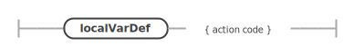

# Описание грамматики
## Комментарии
`#` - однострочные, `#- ... -#` - многострочные

## Структура файла
Файл состоит из определений глобальных неизменяемых переменных и функций.

## Глобальные переменные
Пример описания глобальной неизменяемой переменной с типом: `x: int = 0`.

Пример описания глобальной неизменяемой переменной без типа: `x = 0`

## Глобальные функции
Функции определяются с помощью ключевого слова `fun`:
```
fun f(x: int, y: int): int
  = +(x, y)
```

Указание типов необязательное, если они выводятся:
```
fun f(x: int, y: int)
  = +(x, y)
```

## Типы
- `int` - 32-битный целочисленный тип
- `(t1, t2, ...)` - тип произведения типов `t1, t2, ...`
- `(t1, t2, ...) -> tn` - тип функции
- `[t]` - тип динамического массива с элементами типа `t`

## Выражения
Выражение - последовательность/блок из атомарных выражений, разделённых `;` (последняя `;` необязательна):
```
f(x, y);
g(x, y);
()
```

Результат выполнения блока - результат выполнения последнего выражения

## Атомарные выражения
- заведение локальных неизменяемых переменных с помощью конструкции `let ... in ...`:
  ```
  let
    x = 0,
    y = 1,
  in
    +(x, y)
  ```
- конструкция ветвления `if ... then ... [else ...] fi`:
  ```
  if ||(g(x, y), f(x, y)) then
    x
  else
    y
  fi
  ```
  если явной ветки `else` нет, то считается, что возвращается `()`
- конструкция выделения памяти под массив на стеке `alloca type[size]` (только внутри функции)
  ```
  let
    x = alloca int[10],
  in
    at(0, x)
  ```
- вызов функции `expr(arg1, arg2, ...)`
  ```
  (if 1 then f else g fi)(x, y)
  ```
- конструкция объекта типа-произведения `(arg1, arg2, ...)`
  ```
  fun func(): () = ()
  fun func2(): (int) = (1,)
  ```
- выражение в скобках `(expr)`
  ```
  let x = (0; 1; 2) in ...
  ```
- идентификатор переменной или функции `ident`
  ```
  let y = 0, x = y in ...
  ```
- целое число `30` или `-20`

## Встроенные функции
- целочисленная арифметика `+, -, *, /, %, &&, ||, ==, !=, <, <=, >, >=`
- функции работы с массивами `[el_t]`
  - `at(idx, arr): el_t` - чтение элемента по индексу
  - `set_at(idx, value, arr): el_t` - запись элемента по индексу, возвращает то же значение
  - `slice(idx, len, arr): [el_t]` - получение массива длины `let` начиная с индекса `idx` внутри `arr` (сейчас длина не используется)
- функции симулятора
  - `simFlush`
  - `simPutPixel`
  - `simClear`
  - `simRand`

# Примеры-тесты в ./examples
- `app.ha` - графическое приложение
- `context.ha` - проверка вложенного разрешения имён
- `fg.ha` - примеры синтаксиса
- `fib.ha` - числа Фибоначчи
- `genericarr.ha` - операции с массивами функций
- `indirect.ha` - косвенный вызов функции
- `sum.ha` - операции с массивами
- `test.ha` - тестовый файл для запуска
- `tuple.ha` - проверка конструкции объектов типов-произведений

# Сгенерированные диаграммы правил

### WS

### LINE_COMMENT

### COMMENT

### DIGIT

### INT

### NEG_INT

### IDENT_START

### IDENT


### file

### funDef

### varDef


### type


### localVarDecl

### localVarDef


### expr


### atomExpr

### ifExpr

### allocaExpr

### letInExpr

### literal

